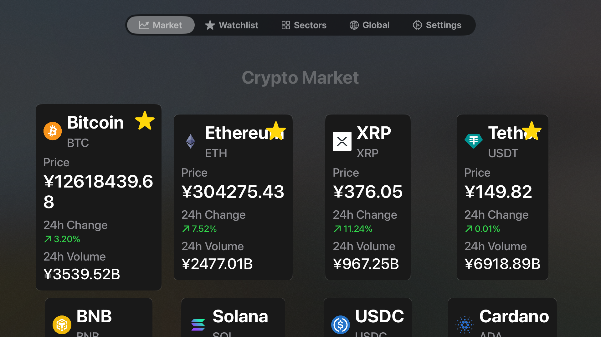
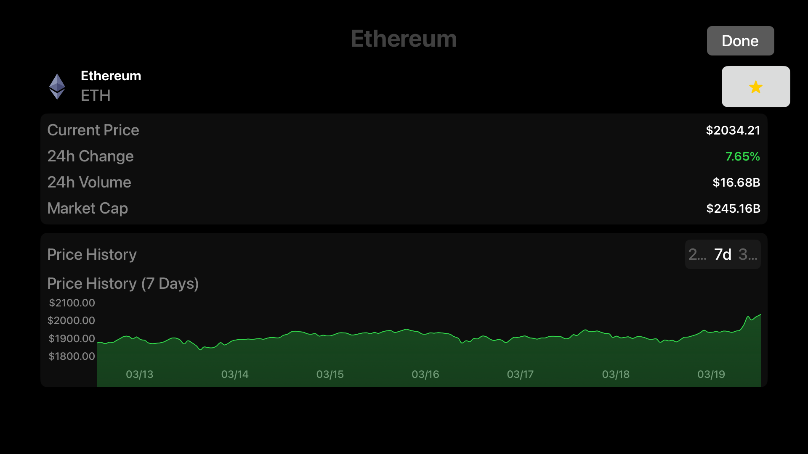
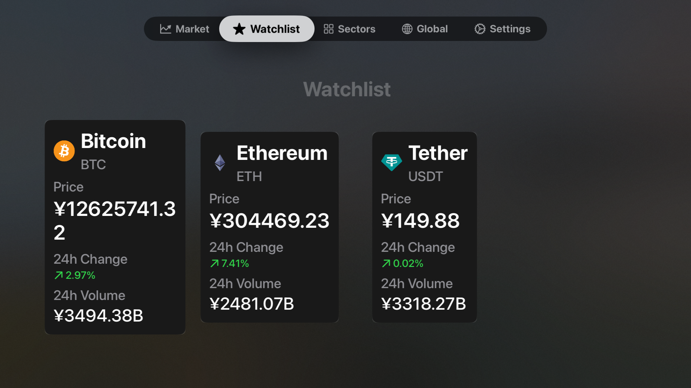
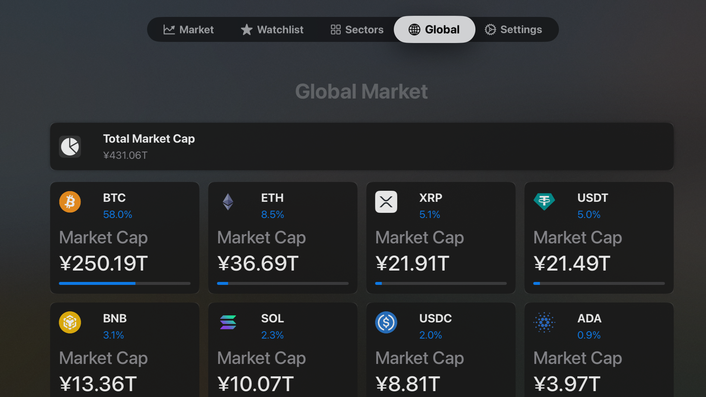
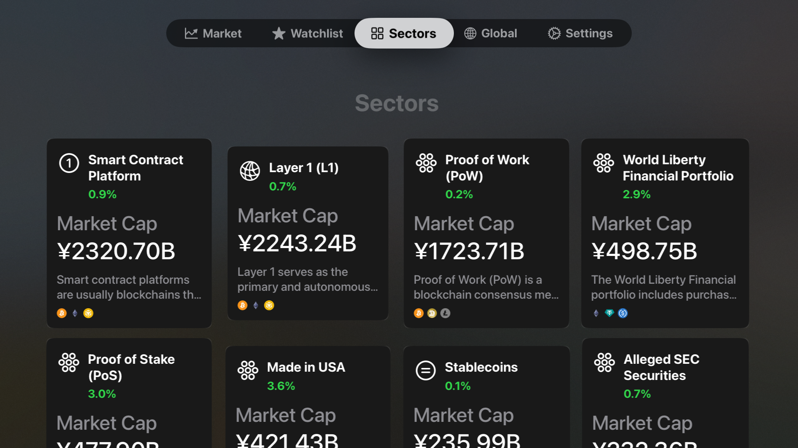
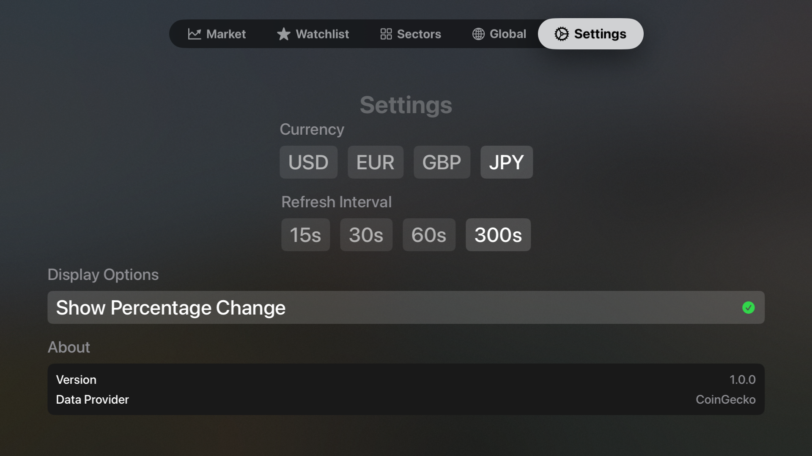

# CryptoMaps

A modern cryptocurrency market tracking app for iOS, macOS and tvOS platforms built with SwiftUI.

## Features

- **Market Overview**: View real-time data for top cryptocurrencies sorted by market cap
- **Detailed Information**: See price, 24h change, volume, and market cap for each cryptocurrency
- **Watchlist**: Save your favorite cryptocurrencies for quick access
- **Sectors**: Explore cryptocurrencies grouped by market sectors
- **Global Market Metrics**: View overall cryptocurrency market statistics
- **Multi-Currency Support**: Convert prices to your preferred fiat currency
- **Cross-Platform**: Works across iOS, macOS, and tvOS with optimized interfaces
- **Smart Caching**: Efficient data caching system to minimize API calls and provide offline functionality
- **Performance Optimized**: Enhanced rendering techniques for smooth scrolling and transitions

## Screenshots

### Market Screen

The Market tab displays a grid of cryptocurrencies sorted by market cap, showing key information like current price and 24-hour change. Users can tap on any cryptocurrency to view detailed information.

### TokenDetail Screen

The TokenDetail view provides comprehensive information about a specific cryptocurrency, including real-time price, 24-hour price change, volume, and market cap. It features an interactive price chart with customizable time periods (24h, 7d, 30d) and the ability to add/remove the token from your watchlist with one tap.

### Watchlist Screen

The Watchlist tab allows users to save and track their favorite cryptocurrencies in one place. Users can add or remove cryptocurrencies from their watchlist with a simple star button toggle from any view in the app.

### Global Market Screen

The Global screen provides an overview of the entire cryptocurrency market, including total market capitalization, 24-hour volume, market dominance percentages, and trending coins. Users can tap on any cryptocurrency dominance card to view detailed information about its market share and comparison with the rest of the market.

### Sectors Screen

The Sectors tab organizes cryptocurrencies by market sectors (such as DeFi, NFTs, Layer 1, etc.), making it easy to track performance of specific segments of the crypto market.

### Settings Screen

The Settings screen provides comprehensive customization options including:
- **Currency Selection**: Choose from multiple fiat currencies (USD, EUR, GBP, etc.) to display all prices and market values
- **Display Preferences**: Toggle 24h percentage change display, dark/light mode settings, and UI density options
- **Notifications**: Configure price alerts and market movement notifications
- **Data Refresh**: Control how frequently the app fetches new data from the API
- **App Information**: Access version details, acknowledgments, and developer contact information
- **Privacy Settings**: Manage data collection and usage preferences

## Requirements

- iOS 16.0+
- macOS 13.0+
- tvOS 16.0+
- Xcode 14.0+
- Swift 5.7+

## Installation

1. Clone the repository:
   ```
   git clone https://github.com/yourusername/cryptomaps.git
   ```

2. Open the project in Xcode:
   ```
   cd cryptomaps
   open cryptomaps.xcodeproj
   ```

3. Select your target device and hit Run

## Architecture

CryptoMaps follows the MVVM (Model-View-ViewModel) architecture pattern:

- **Models**: Define the data structures (Cryptocurrency, Sector, GlobalData)
- **Views**: Implement the UI components with SwiftUI
- **ViewModels**: Handle business logic and data processing

### Key Components:

- **Enhanced Caching System**: Multi-level caching strategy with memory-first approach and UserDefaults persistence
- **Rate Limiting**: Smart request management to respect API rate limits
- **Retry Mechanism**: Automatic retry with exponential backoff for network failures
- **View Optimization**: Component extraction and lazy loading for better performance

## API

CryptoMaps uses the [CoinGecko API](https://www.coingecko.com/en/api) to fetch cryptocurrency data. The app implements caching and rate limiting to respect API usage guidelines.

## Contributing

Contributions are welcome! Please feel free to submit a Pull Request.

1. Fork the project
2. Create your feature branch (`git checkout -b feature/amazing-feature`)
3. Commit your changes (`git commit -m 'Add some amazing feature'`)
4. Push to the branch (`git push origin feature/amazing-feature`)
5. Open a Pull Request

## License

This project is licensed under the MIT License - see the LICENSE file for details.

## Acknowledgments

- [CoinGecko](https://www.coingecko.com/) for providing the cryptocurrency data API
- [SwiftUI](https://developer.apple.com/xcode/swiftui/) for the UI framework 